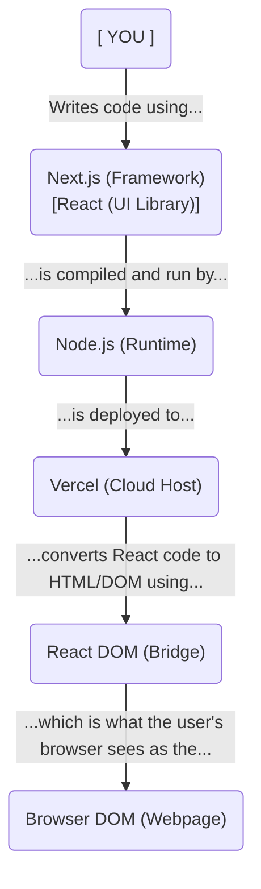
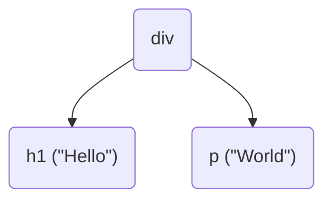

# sillydodo.net

> Personal portfolio and passion project built with modern web technologies.

## Project Goals

- Build a modern portfolio website to showcase projects and experience
- Learn Next.js, TypeScript, and DevOps best practices
- Document learnings about DNS, networking, and web infrastructure
- Create foundation for future features (blog, merch store)

## Tech Stack Explained

### **Next.js** - Web Framework

- **What**: React framework for production-ready websites
- **Why**: Automatic routing, server-side rendering, optimized performance, built-in TypeScript support
- **Link**: https://nextjs.org/
- **Version**: App Router (modern standard)

### **React** - UI Library

- **What**: JavaScript library for building user interfaces
- **Why**: Component-based architecture, massive ecosystem, industry standard
- **Link**: https://react.dev/

### **React DOM** - Browser Bridge

- **What**: Connects React components to the browser's Document Object Model (DOM)
- **Why**: Renders React code as actual HTML in the browser
- **Link**: https://react.dev/reference/react-dom

### **Node.js** - Runtime Environment

- **What**: Executes JavaScript on the server (not just browsers)
- **Why**: Required for Next.js to run, powers the development server
- **Link**: https://nodejs.org/

### **TypeScript** - Programming Language

- **What**: JavaScript with type safety
- **Why**: Catches errors before runtime, better IDE support, self-documenting code
- **Link**: https://www.typescriptlang.org/

### **Vercel** - Hosting Platform

- **What**: Cloud platform optimized for Next.js (built by same company)
- **Why**: Free tier, automatic deployments, global CDN, serverless functions
- **Link**: https://vercel.com/

### **Porkbun** - Domain Registrar

- **What**: Domain name registration and DNS management
- **Why**: Affordable pricing, good DNS management interface
- **Link**: https://porkbun.com/

### **complete-lint** - Code Quality Tools

- **What**: Meta-package with ESLint, Prettier, and cspell
- **Why**: Enforces code style, catches errors, checks spelling automatically
- **Link**: https://complete-ts.github.io/

---

## How It All Works Together



### What is the DOM?

The **DOM (Document Object Model)** is how browsers represent webpages as a tree of objects:

```html
<div>
  <h1>Hello</h1>
  <p>World</p>
</div>
```

Becomes this tree structure in memory:



**Why it matters:**

- JavaScript can manipulate the DOM dynamically
- React/Next.js automate DOM updates for you
- **React DOM** is the library that converts React code into actual DOM elements

---

## Setup

### Prerequisites

```bash
# Check Node.js (need 18.17+)
node --version

# Check npm
npm --version
```

### Installation

```bash
# 1. Clone repository
git clone [https://github.com/Jeenil/sillydodo.git](https://github.com/Jeenil/sillydodo.git)
cd sillydodo

# 2. Initialize npm and install linting tools
npm init -y
npm install -D complete-lint

# 3. Install Next.js, React, and React DOM
npm install next@latest react@latest react-dom@latest

# 4. Start development server (coming soon!)
npm run dev
```

---

## Project Structure

```
sillydodo/
├── .gitignore          # Git ignore rules
├── cspell.json         # Spell checker config
├── tsconfig.json       # TypeScript config (extends complete-tsconfig)
├── package.json        # Project dependencies
├── package-lock.json   # Locked dependency versions
└── README.md           # This file

Coming soon:
├── app/
│   ├── layout.tsx      # Root layout (wraps all pages)
│   ├── page.tsx        # Homepage (/)
│   └── globals.css     # Global styles
```

## Completed

- [x] Purchase domain (sillydodo.net)
- [x] Initialize Git repository
- [x] Set up GitHub repo
- [x] Configure .gitignore
- [x] Install complete-lint (ESLint, Prettier, cspell)
- [x] Configure TypeScript with strict settings
- [x] Document tech stack and architecture
- [x] Create comprehensive README

## TO DO

- [] Add more notes for the Vercel config and DNS Notes.
